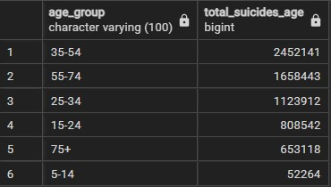
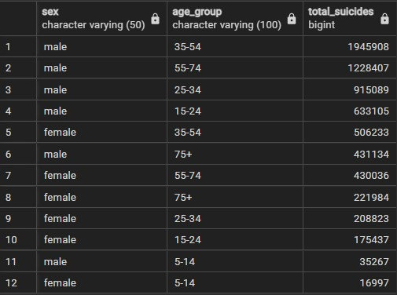
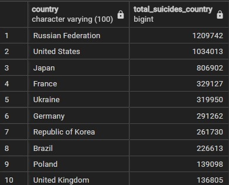
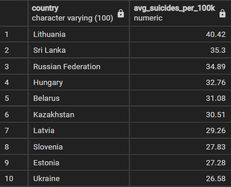
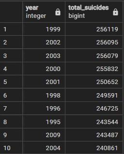

#### 1. How many suicides happened from 1985 to 2016?
 ``` SQL
 SELECT SUM(suicides_no) AS total_suicides
	FROM suicide_rates; 
  ```
  
  
#### 2. How many suicides/ gender?
  
  ```SQL
  SELECT sex, 
	SUM(suicides_no) AS total_suicides_gender
FROM suicide_rates
GROUP BY sex
ORDER BY total_suicides_gender DESC;
```


 
#### 3. How many suicides by age group?
 
 ```SQL
 SELECT age_group, 
	SUM(suicides_no) AS total_suicides_age 
FROM suicide_rates
GROUP BY age_group
ORDER BY total_suicides_age DESC;
```


#### 4. How many suicides by gender and age group?

 ```SQL
 SELECT sex, age_group, 
	SUM(suicides_no) AS total_suicides 
FROM suicide_rates
GROUP BY sex, age_group
ORDER BY total_suicides DESC;
```


#### 5. Top 10 countries by suicides number
  
```SQL
SELECT country, 
	SUM(suicides_no) AS total_suicides_country 
FROM countries
INNER JOIN suicide_rates
	ON countries.country_id = suicide_rates.country_id
GROUP BY country
ORDER BY total_suicides_country DESC
LIMIT 10;
```


#### 6. Which country/ies had the fewest suicides?
```SQL
SELECT c.country, 
	SUM(s.suicides_no) AS total_suicides 
FROM suicide_rates s
INNER JOIN countries c
	ON s.country_id = c.country_id
GROUP BY c.country
HAVING SUM(s.suicides_no) = (
			     SELECT MIN(total_suicide) 
			     FROM (
				SELECT SUM(suicides_no) AS total_suicide
				FROM suicide_rates
				GROUP BY country_id
				) AS suicide_totals
			     );
```


#### 7. On average, how many suicides/100k pop happened during this period?

```SQL
SELECT ROUND(AVG(suicides_per_100k),2) AS avg_suicides_per_100k 
FROM suicide_rates;
```


#### 8. On average, how many suicides/100k pop happened during this period for each gender?

```SQL
SELECT sex, 
	ROUND(AVG(suicides_per_100k),2) AS avg_suicides_per_100k 
FROM suicide_rates
GROUP BY sex
ORDER BY avg_suicides_per_100k DESC;
```


#### 9. On average, which countries had the highest number of suicides/100k pop?

```SQL
SELECT c.country, 
	ROUND(AVG(s.suicides_per_100k),2) AS avg_suicides_per_100k
FROM suicide_rates s
INNER JOIN countries c
	ON s.country_id = c.country_id
GROUP BY c.country
ORDER BY avg_suicides_per_100k DESC
LIMIT 10;
```


#### 10. Which years had the greatest number of suicides? (top 10)

```SQL
SELECT y.year, 
	SUM(s.suicides_no) AS total_suicides 
FROM suicide_rates s
INNER JOIN years y
	ON s.year_id = y.year_id
GROUP BY y.year
ORDER BY total_suicides DESC
LIMIT 10;
```


			    
#### 11. Which year had the fewest suicides?

```SQL
SELECT y.year, 
	SUM(s.suicides_no) AS min_total_suicides 
FROM suicide_rates s
INNER JOIN years y
	ON s.year_id = y.year_id
GROUP BY y.year
HAVING SUM(s.suicides_no) = (
			     SELECT MIN(suicides) 
				FROM (
					SELECT SUM (suicides_no) AS suicides 
					ROM suicide_rates
					GROUP BY year_id
					) AS suicides_total
				);
```


#### 12. Which country in what year had the greatest number of suicides?

```SQL
SELECT c.country, 
	y.year, 
	SUM(s.suicides_no) AS total_suicides 
FROM countries c
INNER JOIN suicide_rates s
	ON c.country_id =  s.country_id
INNER JOIN years y
	ON s.year_id = y.year_id
GROUP BY c.country, y.year
HAVING SUM(s.suicides_no) = (
			     SELECT MAX(suicides)
			     FROM (
				SELECT SUM(suicides_no) AS suicides
				FROM suicide_rates
				GROUP BY country_id, year_id
				) AS suicide_total
			      );
```


#### 13. Men from which country had the highest number of suicides?

```SQL
SELECT s.sex, c.country, SUM (s.suicides_no) AS total_suicides FROM suicide_rates s
INNER JOIN countries c
ON s.country_id = c.country_id
WHERE s.sex = 'male'
GROUP BY s.sex, c.country, s.age_group
ORDER BY total_suicides DESC
LIMIT 1;
```


#### 14. Women from which country had the highest number of suicides?

```SQL
SELECT s.sex, 
       c.country, 
       SUM (s.suicides_no) AS total_suicides 
FROM suicide_rates s
INNER JOIN countries c
	ON s.country_id = c.country_id
WHERE s.sex = 'female'
GROUP BY s.sex, 	
	c.country, 
	s.age_group
ORDER BY total_suicides DESC
LIMIT 1;
```


#### 15. When it comes to men who committed suicide, what was the age group and country for those who comitted the highest number of suicides?

```SQL
SELECT  s.sex, 
        c.country, 
	s.age_group, 
	SUM (s.suicides_no) AS total_suicides 
FROM suicide_rates s
INNER JOIN countries c
	ON s.country_id = c.country_id
WHERE s.sex = 'male'
GROUP BY s.sex, 
	 c.country, 
	 s.age_group
ORDER BY total_suicides DESC
LIMIT 1;
```


#### 16. When it comes to women who committed suicide, what was the age group and country for those who comitted the highest number of suicides?
```SQL
SELECT  s.sex,
	c.country, 
	s.age_group, 
	SUM (s.suicides_no) AS total_suicides FROM suicide_rates s
INNER JOIN countries c
	ON s.country_id = c.country_id
WHERE s.sex = 'female'
GROUP BY s.sex, 
	 c.country, 
	 s.age_group
ORDER BY total_suicides DESC
LIMIT 1;
```

 
 #### 17. What gender from what age group from which country in what year comitted the highest number of suicides?
 ```SQL
SELECT  s.sex, 
	c.country, 
	s.age_group, 
	y.year, 
	SUM (s.suicides_no) AS total_suicides 
FROM suicide_rates s
INNER JOIN countries c
	ON s.country_id = c.country_id
INNER JOIN years y
	ON s.year_id = y.year_id
GROUP BY s.sex, 
	 c.country, 
	 s.age_group, 
	 y.year
ORDER BY total_suicides DESC
LIMIT 1;
```


#### 18. When it comes to women who committed suicide, what was the year, country and age group  for those who comitted the highest number of suicides?
```SQL
SELECT s.sex, 
       y.year, 
       c.country, 
       s.age_group,  
       SUM (s.suicides_no) AS total_suicides 
FROM suicide_rates s
INNER JOIN countries c
	ON s.country_id = c.country_id
INNER JOIN years y
	ON s.year_id = y.year_id
WHERE s.sex = 'female'
GROUP BY s.sex, 
	 y.year, 
	 c.country, 
	 s.age_group 
ORDER BY total_suicides DESC
LIMIT 1;
```

